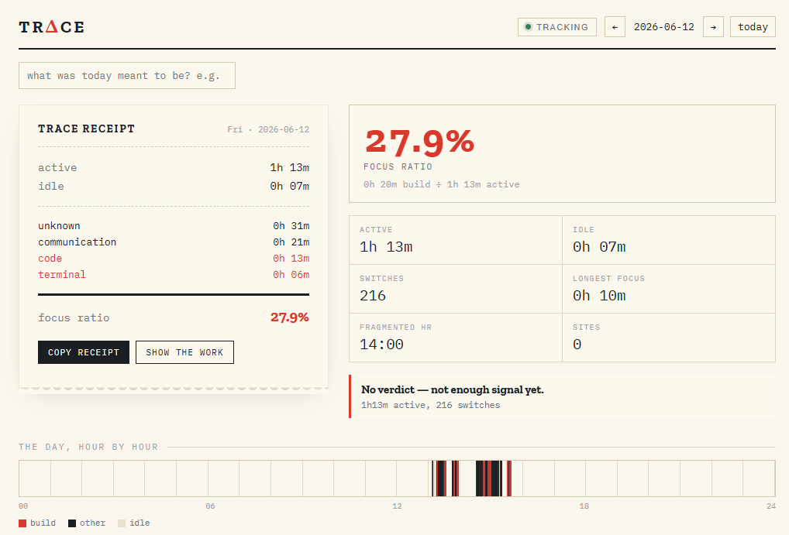

# Trace

> Your machine kept receipts.


Trace is a local-only activity recorder for people who build. It watches which app is in front of you, how long you stay there, and how much you type and click — then turns the day into a plain-text **receipt** that shows its work: every number carries the arithmetic that produced it, and a verdict it can defend from the tally.

No account. No cloud. No sync. It never stores typed text, screenshots, the clipboard, packet contents, or full URLs — only metadata, in one SQLite file on your disk that you can read, export, or delete. This is a personal forensic tool, not a monitor. There is no one to report to but you.

<p align="center">
  <br>
  <sub>Trace with a currently tracked Receipt and Focus Ratio (sample data)</sub>
</p>

## Quickstart

Prerequisites: a [Rust toolchain](https://rustup.rs), [Node 18+](https://nodejs.org), and on Windows the MSVC build tools + WebView2 (preinstalled on Windows 11).

```
git clone https://github.com/lambdaf-org/trace
cd trace
npm install
npm run tauri dev
```

The database lives at the OS app-data dir (`%APPDATA%/org.lambdaf.trace/trace.db` on Windows). Delete that file and the history is gone — there is nowhere else it went.

Build a Windows installer:

```
npm run tauri icon assets/logo.png   # one-time, generates icons/
npm run tauri build                   # produces an NSIS + MSI bundle
```

## What Trace records / never records

| Records (metadata only)        | Never records                          |
| ------------------------------ | -------------------------------------- |
| Active app + process name      | Typed text / keystroke contents        |
| Window title (toggleable)      | Screenshots or screen recording        |
| Active browser **domain**      | Full URLs / query parameters / page text|
| Start / end / duration         | Clipboard contents                     |
| Keypress **count** (not keys)  | Packet contents, cookies, storage      |
| Mouse click count + travel     | Passwords or secrets                   |
| Idle vs active                 | Clicks/keys mapped to content          |

The keypress counter is the line that matters: the raw-input handler increments a number and never inspects which key fired. That is the whole difference between a counter and a keylogger, and it is enforceable in one function. See [docs/PRIVACY.md](docs/PRIVACY.md).

## Features

- **Activity segments**: every stretch in an app is one row — app, process, title, duration, and the input counts for that stretch.
- **Idle detection**: away time is measured system-wide via `GetLastInputInfo` and marked as its own segment, never folded into active time.
- **Daily receipt**: a copyable plain-text summary plus a **formula view** that prints the worked arithmetic behind each number — the receipt is the product.
- **Computed verdicts**: opinionated, deterministic verdicts ("you prompted more than you implemented") where each line prints the metric that triggered it. No vibes.
- **Editable categories**: a local rules table maps processes to categories (`code`, `terminal`, `browser`, …); you own the rules.
- **Claim vs reality**: label a day's intent ("coding day") and the receipt reconciles what you said against what the machine measured.
- **One file, your disk**: SQLite, WAL-mode, no service, no network. Pause from the tray; delete any day or session.

## How it works

```
OS activity  →  Rust collector  →  activity segments  →  SQLite  →  daily metrics  →  receipt
```

A single Rust collector watches three signals on Windows: the foreground window (process + title), system idle time, and input counts from the Raw Input API registered with `RIDEV_INPUTSINK` so it can count across apps without focus. A segmenter closes the current segment and opens a new one whenever the app, title, or idle state changes, attaching the input counts accumulated during that stretch. Segments land in SQLite; the frontend never touches the database — it asks the Rust side through Tauri commands, so the privacy boundary is one module.

Metrics are computed deterministically over a day's ordered segments — active/idle split, category and app breakdowns, context switches, longest focus block, most fragmented hour, and the focus ratio — then rendered as the receipt and its formula view. Nothing is asserted that the tally cannot back.

## Privacy

Trace is built so the privacy claims are structural, not promises. The collector uses only unprivileged Win32 calls — no driver, no injection, no admin. Input is counted, never captured. Everything stays in a single local file. The full record-vs-never list is in [docs/PRIVACY.md](docs/PRIVACY.md), and the implementation plan is in [docs/PLAN.md](docs/PLAN.md).

## Roadmap

V0 is Windows-first and deliberately small. Browser-**domain** tracking now ships in V0 (read from the address bar via UI Automation, query strings stripped, host-only by default). Later, opt-in only: richer per-path rules, network **metadata** (domain, port, protocol, bytes — never contents), weekly receipts and multi-week trends, JSON import/export, and an opt-in encrypted screenshot mode that is off by default. macOS and Linux collectors are possible behind the same segmenter.

## Contributing

Lambdaforge is open source and contributions are welcome. Start with the [contributor guide](https://github.com/lambdaf-org/contributing), and see the org-wide [CONTRIBUTING](https://github.com/lambdaf-org/.github/blob/main/CONTRIBUTING.md) and [Code of Conduct](https://github.com/lambdaf-org/.github/blob/main/CODE_OF_CONDUCT.md).

## License

This repository does not yet include a `LICENSE` file, so default copyright applies for now. A license is coming soon. If you want to use or build on this before then, please open an issue.
